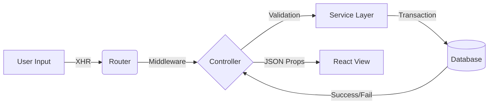

# System Architecture: The Circuit Board

> **Engineering Philosophy:** Software architecture should be as logical and traceable as a hardware schematic. Input -> Process -> Output.

---

## 1. System Topology (High Level)

### The "Hybrid Monolith"
We utilize a unified monolith structure (`Inertia.js`) to eliminate the latency and complexity of separate API/Client repositories.

**Analogy:** Instead of a separate "Control Board" (API) and "Display Panel" (SPA) wired together with fragile cables (HTTP/REST), we build an **Integrated Circuit (IC)** where the logic and display share the same board.

#### The Stack
1.  **Logic Core:** Laravel 12 (PHP 8.2+).
2.  **Display Interface:** React 19.
3.  **Signal Bridge:** Inertia.js.
4.  **Storage:** MySQL / SQLite.

---

## 2. Logic Flow (Input -> Process -> Output)

### 2.1 The Request Cycle
Every user interaction follows a strict path, similar to a signal trace:

### 2.2 Traceability
*   **Controller:** Acts as the Gatekeeper. Purely handles routing traffic.
*   **Service:** Acts as the Processor. Contains business logic.
*   **Model:** Acts as the Storage Cell.

---

## 3. Modularity (Field Replaceable Units)

Just as a technician replaces a faulty capacitor, we design components to be isolated and replaceable.

### 3.1 React Components
*   **Atoms:** Buttons, Inputs. (Standard Resistors).
*   **Molecules:** Task Cards, Modals. (Integrated Circuits).
*   **Organisms:** Kanban Board. (The Motherboard).

### 3.2 Service Isolation
The `TaskService` handles strict logic (Moving, Editing). If the Drag-and-Drop logic fails, it does not crash the Authentication system. They are on separate circuits.

---

## 4. Failure Modes & Reliability

**"If a component fails, the system dies."**
This hardware mantra applies here. We mitigate failure via:

1.  **Database Transactions:**
    *   *Problem:* Power loss (network failure) during a task move.
    *   *Solution:* ACID transactions. Either the task moves completely, or it snaps back. No "half-moved" states.

2.  **Strict Typing (TypeScript):**
    *   *Problem:* Wiring a 5V line to a 12V input (Type Error).
    *   *Solution:* We enforce types on all Props to ensure `BoardID` is always an Integer, never a String.

---

## 5. Security Protocols

*   **CSRF Protection:** Standard "Grounding" for all form inputs.
*   **Policy Gates:** `TaskPolicy.php` acts as a fuse. If User A tries to edit User B's board, the fuse blows (403 Forbidden) before logic executes.
