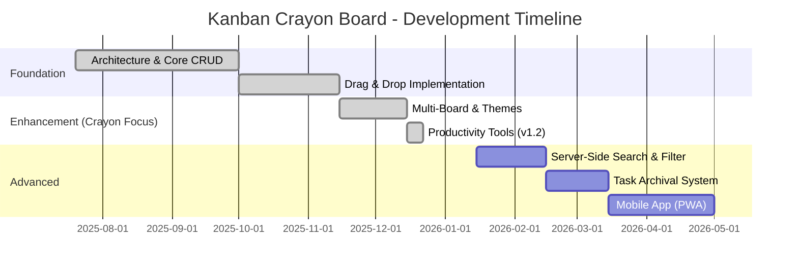

# Product Roadmap

**Last Updated:** December 21, 2025  
**Version:** 1.2.0-beta

---

## Vision Statement
Build the most delightful personal Kanban board that balances simplicity with power, serving as both a daily productivity tool and a portfolio showcase of modern full-stack capabilities.

---

## Roadmap Overview (Gantt)

---

## ✅ Phase 1: Core Foundation (Q3 2025)
- [x] Laravel 12 + React + Inertia backend
- [x] SQLite database schema
- [x] Basic Task CRUD

## ✅ Phase 2: User Experience (Q4 2025)
- [x] Drag and drop engine (`dnd-kit`)
- [x] Glassmorphism UI & Dark Mode
- [x] Quick Add & Inline editing
- [x] User avatars & profile management

## ✅ Phase 3: Productivity Suite (Dec 2025)
- [x] Multi-Board workspace management
- [x] Task Tagging & Labeling system
- [x] WIP Limits & Visual Alerts
- [x] Commenting & Discussion history
- [x] Cycle Time Analytics Dashboard

## 🚧 Phase 4: Scaling & Connectivity (Q1 2026)
- **4.1 Advanced Search**: Implement server-side search (Inertia + Scout/Meilisearch).
- **4.2 Archival Board**: Separate view for long-term storage of "Done" tasks.
- **4.3 Export Tools**: Export boards as PDF or CSV.

## 📋 Phase 5: Ecosystem & Mobile (Q2 2026)
- **5.1 PWA Support**: Offline-first capability with manifest and service workers.
- **5.2 API Integrations**: Webhooks for task updates and external project sync.
- **5.3 Collaborative Mode**: Socket.io/Echo implementation for real-time team collaboration.

---
**Note:** Accelerated development in Dec 2025 moved several Phase 4 items into Phase 3 (Delivered).
