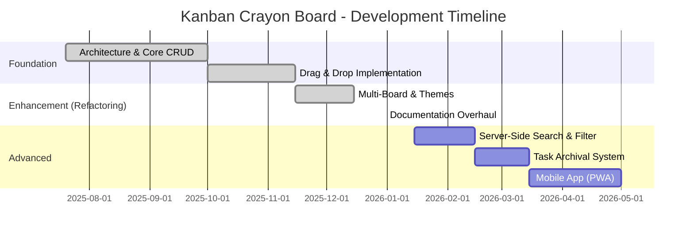

# Product Roadmap

**Last Updated:** December 21, 2025
**Version:** 1.2.0-beta

---

## Vision Statement
To engineer a personal Kanban board that balances operational stability with user-centric efficiency, serving as a functional portfolio of modern full-stack systems integration.

---

## 1. Development Timeline (Gantt)

```mermaid
gantt
    title Kanban Crayon Board - Development Timeline
    dateFormat YYYY-MM-DD
    section Foundation
    Architecture & Core CRUD    :done, 2025-07-20, 2025-10-01
    Drag & Drop Implementation :done, 2025-10-01, 2025-11-15

    section Enhancement (Refactoring)
    Multi-Board & Themes       :done, 2025-11-15, 2025-12-15
    Documentation Overhaul     :done, 2025-12-31, 2025-12-31

    section Advanced
    Server-Side Search & Filter: 2026-01-15, 2026-02-15
    Task Archival System       : 2026-02-15, 2026-03-15
    Mobile App (PWA)           : 2026-03-15, 2026-05-01
```

---

## 2. Phase 1: Core Foundation (Q3 2025)
**Status:** Complete

*   **Backend:** Laravel 12 + React + Inertia stack initialization.
*   **Database:** SQLite schema design and implementation.
*   **functionality:** Basic Task CRUD operations.

## 3. Phase 2: User Experience (Q4 2025)
**Status:** Complete

*   **Interaction:** Drag and drop engine (`dnd-kit`) integration.
*   **UI System:** Glassmorphism UI and Dark Mode implementation.
*   **Efficiency:** Quick Add and Inline editing features.
*   **Identity:** User avatars and profile management.

## 4. Phase 3: Productivity Suite (Dec 2025)
**Status:** Complete

*   **Workspace:** Multi-Board workspace management.
*   **Organization:** Task Tagging and Labeling system.
*   **Control:** WIP Limits and Visual Alerts.
*   **Collaboration:** Commenting and Discussion history.
*   **Metrics:** Cycle Time Analytics Dashboard.

## 5. Phase 4: Scaling & Connectivity
**Status:** Planned

### 4.1 Advanced Search
Implement server-side search using Inertia and Laravel Scout/Meilisearch to handle dataset growth beyond client-side limits.

### 4.2 Archival Board
Create a separate view for long-term storage of "Done" tasks to maintain performance of the active board.

### 4.3 Export Tools
Implement data portability features (PDF/CSV export) for backup and reporting.

## 6. Phase 5: Ecosystem & Mobile
**Status:** Planned

### 5.1 PWA Support
Establish offline-first capability with manifest and service workers.

### 5.2 API Integrations
Enable webhooks for task updates and external project synchronization.

### 5.3 Collaborative Mode
Implement Socket.io/Echo for real-time team collaboration updates.
